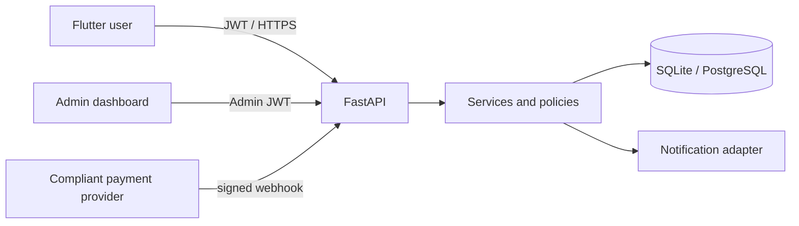
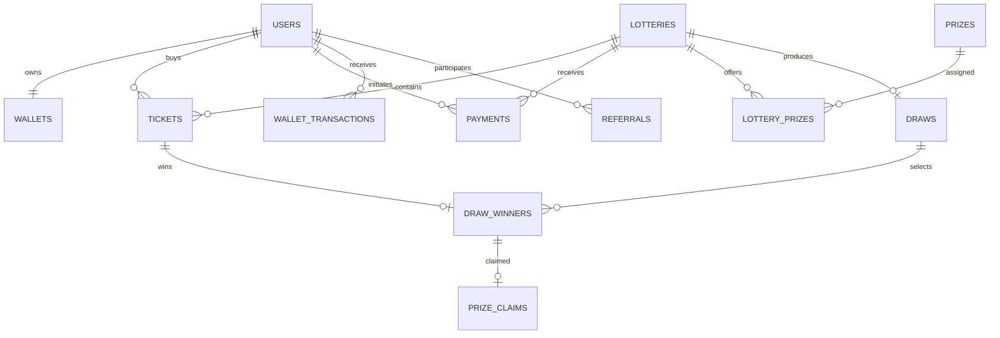

# Architecture and product specification

## System

Flutter talks only to versioned FastAPI endpoints. FastAPI owns identity, eligibility,
prices, payment verification, tickets, ledger balances and draws. SQLAlchemy keeps
SQLite/PostgreSQL portability. The HTML admin is served by the same API and uses RBAC.
Provider adapters verify signed webhooks; returning from a UPI app never confirms payment.

## Data model

Tables also include sessions, notifications, admin_users, audit_logs and app_settings.
Foreign keys, uniqueness on mobile/referral/ticket/payment/draw, and indexes enforce invariants.

## Flows

- User: register/login → browse → create payment → launch UPI → wait for signed webhook → ticket → draw/result/claim.
- Admin: login → manage prize/lottery → activate/close → inspect eligible tickets → irreversible draw → claims/reports/audit.
- Payment: create idempotent order → provider deep link → signature + provider reference verification → atomic success/ticket/ledger/referral.
- Draw: freeze and sort eligible ticket IDs → commit hash → `secrets` seed → deterministic SHA-256 ranking → three unique winners → immutable verification hash.

## Security model

Argon2 passwords, short access/rotating refresh tokens, token hashes in sessions, RBAC,
rate limiting, allow-listed CORS, security headers, Pydantic validation, ORM queries,
signed/idempotent webhooks, immutable wallet ledger and audit logging. Production must use
HTTPS, a secrets manager, PostgreSQL, managed object storage, backups and a legally approved
payment provider. Jurisdiction, age/KYC and responsible-participation checks are policy hooks.

## API summary

OpenAPI at `/docs` in development covers `/api/auth`, `/api/users`, `/api/lotteries`,
`/api/payments`, `/api/tickets`, `/api/wallet`, `/api/referrals`, `/api/winners`,
`/api/draws`, `/api/notifications`, and `/api/admin`. Errors use
`{success:false,message,error_code}`.

## Delivery phases

1. Database/auth  2. lottery/prizes/tickets  3. payment adapter  4. wallet/referrals
5. auditable draws  6. admin  7. Flutter UI  8. notifications/claims
9. security/tests  10. container-ready deployment.

